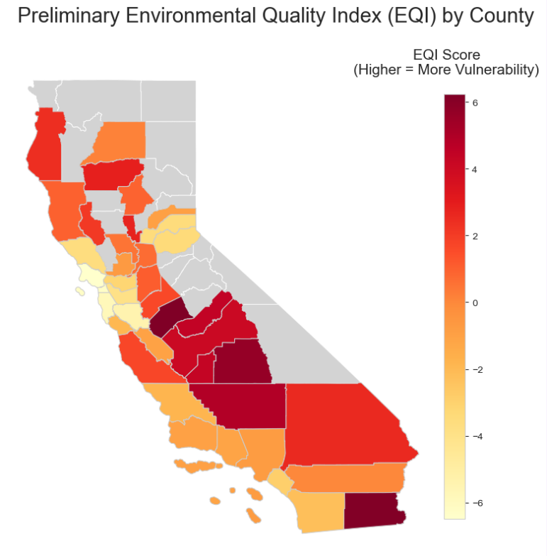
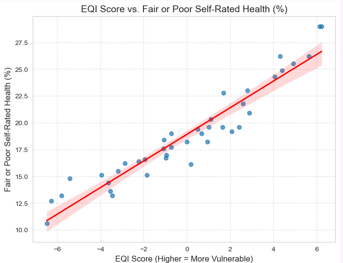

# Environmental Quality Index (EQI) for California Counties

**Last Updated: October 2025**

---

## 1. Project Objective

The purpose of this project is to develop an **Environmental Quality Index (EQI)** that quantifies the environmental vulnerability of communities within California through comparing trends between datasets on pollution and green spaces against demographic and public health data from the CDC. 

---

## 2. Data Sources

The following datasets were downloaded on **October 3, 2025**.

* **Health Outcomes:** [CDC PLACES - County-level Data, 2024 Release](https://data.cdc.gov/500-Cities-Places/PLACES-Local-Data-for-Better-Health-County-Data-20/swc5-untb/about_data)
    * *File:* `cdc_places_county_california_2024.csv`
    * *Scope:* **California**
* **Air Quality:** [EPA Annual AQI by County, 2024](https://aqs.epa.gov/aqsweb/airdata/download_files.html)
    * *File:* `epa_aqi_county_usa_2024.csv`
    * *Scope:* **United States**
* **Demographics:** [U.S. Census Bureau - ACS 1-Year Estimates, Table DP03, 2024](https://data.census.gov/table?q=DP03)
    * *Files:* `census_economic_county_california_2024.csv` and `census_economic_county_california_2024_column_metadata.csv`
    * *Scope:* **California**
  
---

## 3. Methodology

The analysis was conducted using Python within a Jupyter Notebook environment. Key steps included:

1.  **Data Acquisition & Cleaning:** Sourced datasets for health outcomes (CDC PLACES), air quality (EPA AQI), and socioeconomic factors (US Census). Cleaned each dataset by:
    * Standardizing column names (`snake_case`).
    * Correcting data types (e.g., converting population counts to numeric).
    * Removing redundant or unnecessary columns (e.g., metadata, footnote columns).
    * Filtering EPA AQI data to California only.
    * Selecting a subset of key socioeconomic indicators from the Census data.
2.  **Data Merging & Preparation:**
    * Validated county names and data types across datasets.
    * Performed an **inner merge** to combine the three sources, resulting in a dataset covering **40 counties** with complete data.
    * Filtered CDC health data to use **age-adjusted prevalence rates** for fair comparison.
    * **Pivoted** the merged data into a "wide" format (one row per county) with each health measure as a separate column.
3.  **Data Standardization:** Scaled all numeric feature columns (excluding identifiers) to have a mean of 0 and a standard deviation of 1 using `scikit-learn`'s `StandardScaler`, a prerequisite for PCA.
4.  **Principal Component Analysis (PCA):** Applied PCA to the standardized feature set to identify principal components summarizing the main patterns of variation. Based on the scree plot, explained variance (~82%), and component interpretability, the **first four principal components** were retained. These components broadly represented:
    * PC1: Physical Health & Disability
    * PC2: Mental Health & Specific Chronic Conditions
    * PC3: General Air Quality
    * PC4: Particulate Air Quality
    
---

## 4. Results & Key Findings

* **EQI Score Distribution:** The calculated EQI scores show significant variation across the 40 analyzed counties, indicating regional disparities. Higher scores represent greater vulnerability.
* **Geographic Patterns:** The choropleth map reveals a distinct spatial pattern, with the highest vulnerability scores concentrated in the Central Valley and Imperial County, while the lowest scores are predominantly found in the Bay Area and some coastal regions.
* **Correlation with Health:** The EQI score demonstrated a strong, statistically significant positive correlation with the percentage of adults reporting fair or poor health, suggesting the index effectively captures dimensions related to adverse community conditions and population health status.

---

## 5. Key Visualizations

* **Scree Plot:** Used to determine the number of principal components to retain (included in the notebook).
* **Choropleth Map:** Displays the geographic distribution of the final EQI scores across the 40 counties.
    
* **Scatter Plot:** Shows the correlation between the EQI score and self-rated fair/poor health.
    

---

## 6. Limitations

* **Data Availability:** Due to missing data in the EPA and Census sources for certain smaller counties, the final analysis and EQI scores cover only **40 of California's 58 counties**.
* **Environmental Scope:** The environmental component of this index is based solely on **EPA air quality (AQI) data**. A more comprehensive EQI could incorporate data on water quality, green space, toxic site proximity, etc.
* **Index Construction:** The EQI score is derived from PCA and reflects the dominant patterns in the specific datasets used. Different variable selections or weighting methods could produce different results.

---

## 7. Technologies Used

* **Language:** Python
* **Environment** Jupyter Notebook
* **Libraries:**
    * `pandas` for data manipulation
    * `numpy` for numerical operations
    * `geopandas` for geographic data processing
    * `scikit-learn` for PCA and data scaling
    * `matplotlib` / `seaborn` for visualizations
    * `scipy` for statistical calculations

---

## 8. How to Run This Project

1.  **Clone Repository:** `git clone https://github.com/shilpa-kannan-11/Environmental-Quality-Index.git`
2.  **Set up Environment:** It is recommended to use Conda.
    * Navigate to the project directory: `cd Environmental-Quality-Index`
    * Create the Conda environment using the provided file (you might need to create this file - see below): `conda env create -f environment.yml`
    * Activate the environment: `conda activate eqi_env`
    * *(Alternatively, provide instructions using `requirements.txt` if you prefer)*
3.  **Download Data:** Ensure the required CSV files (CDC, EPA, Census, Census Metadata) and the county shapefile are placed correctly within the `data` folder as expected by the notebook.
4.  **Run Notebook:** Launch Jupyter Notebook (`jupyter notebook`) and open the `01_EQI_Analysis_Workflow.ipynb` file. Run the cells sequentially.